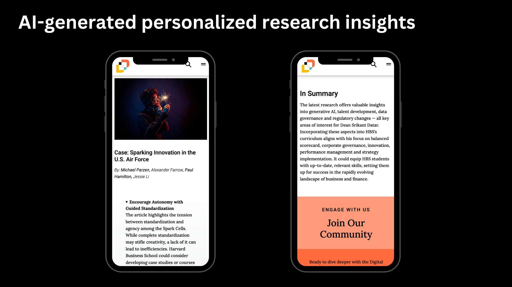
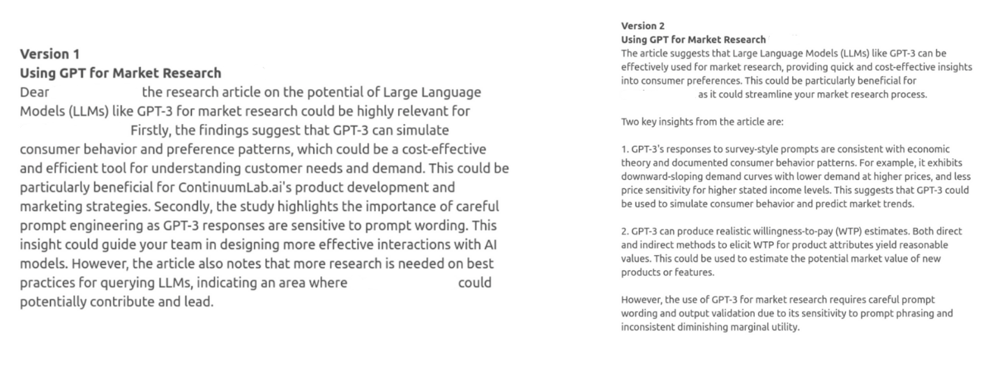

>###### Technical deep dive into generating personalized recommendations of research summaries tailored for C-level executives. This system translates dense research into clear, actionable insights, reducing time-to-decision and improving strategic alignment across teams. For research organizations, it creates a new channel to showcase work in an executive-friendly format, increasing visibility and influence.

Executives often face a flood of technical research that is difficult to digest quickly. Research teams publish detailed studies, experimental results, and reports filled with jargon and dense data. While these insights are valuable, translating them into clear direction for leadership is rarely straightforward.

As a data scientist, I designed a recommendation algorithm that delivers personalized research summaries. These were presented through a mobile-first web page, making them accessible during the event in real time.

The central question driving my work was whether individuals with extensive public profiles, such as those featured in Wikipedia or news articles, would receive higher-quality recommendations from LLMs like GPT-4. Since these models are pretrained on large corpora, they often already “know” a great deal about public figures. This suggested a possible advantage in cold start scenarios, where no prior user behavior data is available.

A second challenge was the relatively small scale of content. Traditional recommender systems thrive on large datasets, but here, the limited number of assets turned into an opportunity. The smaller database fit easily within the LLM’s context window, and prior research on few-shot recommendation [Dai et al.](https://arxiv.org/pdf/2305.02182.pdf), [Wang](https://arxiv.org/abs/2312.13557) suggested that quality results could still be achieved.

To build the system, I relied on iterative prompt engineering. GPT-4 generated recommendations from the curated asset list, and I compared performance against GPT-3.5 and alternative prompts using structured A/B tests. Feedback from project stakeholders guided refinements, helping us tune for quality and relevance.

 

One persistent issue was position bias. LLMs tend to favor items that appear near the top of a list. Instead of treating this as a flaw, I reframed it as a feature. By ordering content based on recency and importance, we nudged the model to naturally promote high-priority research.

Summarization was another key element. I built an ingestion pipeline and experimented with few-shot prompts to ensure outputs followed a consistent, executive-friendly format. LLMs often default to verbose text, so I added instructions to keep responses concise and used temperature tuning to strike the right balance between detail and clarity. Prior research provided useful guidance here.

In the final stage, I adjusted intro and conclusion text temperature upward to encourage greater variability in tone and structure. The temperature parameter controls the randomness of the predictions by scaling the logits before applying the softmax operation. A higher temperature results in a softer probability distribution over the words, making the model more likely to choose less probable words, thereby increasing diversity and creativity in the output. This gave summaries a more personal touch, producing creative opening and closing statements tailored to each recipient, while retaining the right level of accurate details in research summaries.

The result was a working proof of concept delivered in just four weeks. Several unexpected recommendations also proved to be highly relevant after closer review.

>Although further testing is essential to assess our initial theory systematically: that individuals with extensive public profiles would receive higher-quality recommendations. Early results appear promising.

This project produced a framework for evaluating research insights. For executives, this system translates dense research into clear, actionable insights, reducing time-to-decision and improving strategic alignment across teams. For research organizations, it creates a new channel to showcase work in an executive-friendly format, increasing visibility and influence at the leadership level. By bridging the gap between technical output and executive decision-making, the prototype demonstrates how AI can directly improve organizational efficiency and the ROI of research investments.