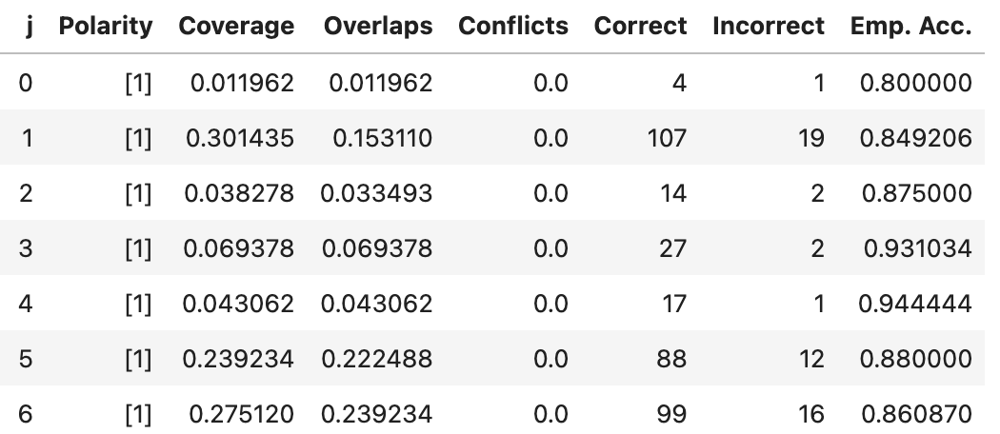
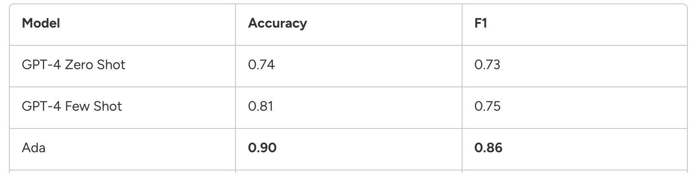

>###### I built an NLP classification model with 0.86 F1 score using a combination of fine-tuned GPT-3 Ada model and FinBERT to classify sentences into AI-related and not on millions data points.

The latest developments in AI and digital transformation are moving at an unprecedented pace, presenting a challenge in identifying organizations actively implementing AI strategies. In a research project aimed at identifying companies mentioning AI technologies in their publicly available quarterly conference call transcripts, traditional methods relied on keyword searches within these documents. These methods, while accurate, suffered from low coverage and a high false negative rate, indicating a need for a more sophisticated approach.

To address this, a machine learning approach was adopted, treating the problem as a classification scenario without labeled data. This approach involved experimenting with Snorkel labeling functions and fine-tuning BERT and GPT models on a small, ground truth dataset, enabling the analysis of 339,711 documents from 2010 to 2022.

#### Snorkel

We started with Snorkel, a framework designed for programmatically creating training data, which is particularly useful in situations like this where labeled data is scarce. Snorkel's framework allows for creation of training data through heuristic-based labeling functions, but limitations in writing complex functions led to no improvement in using Snorkel's generative model over pure heuristic-based approach. Snorkel's generative model takes into account the accuracy and correlations of the labeling functions based on their performance on a small labeled dataset. While Snorkel alone didn't get us to the accuracy we were expecting it provided valuable exploratory data analysis and baseline metrics.

#### Fine-tuning
Subsequently, running AWS Sagemaker AutoML on a FinBERT and BERT embedding to cover all possible model scenarios and finally fine-tuning a FinBERT model led to significant improvements, especially in precision rates. Fine-tuned FinBERT achieved a high precision rate of 0.96, far surpassing traditional keyword matching methods. However, the model's recall rate of 0.58 highlighted ongoing challenges. FinBERT excelled at identifying true negatives, which facilitated the use of AWS Batch Transform to parallelize inference across millions of sentences, effectively discarding those unrelated to AI. Choosing FinBERT over GPT model from the start made this approach feasible, when considering compute time and cost.

In the final phase, exploring the capabilities of GPT models, including GPT-4, GPT-3.5, and a fine-tuned GPT-3 Ada model, showed notable improvements in accuracy and recall rates. Despite some sentences presenting complex challenges in determining AI relevance, even for human labelers, setting up scenarios for few and zero-shot learning and fine-tuning the GPT-3 Ada model led to substantial improvements. The F1 score improved from 0.75 in a GPT-4 few-shot scenario to 0.86 with a fine-tuned GPT-3 Ada model, suggesting that tasks of lower complexity could be accomplished with smaller, less computationally demanding models but with a fine-tuning step.

This exploration into identifying AI mentions within corporate communications showcased the evolution from simple keyword matching to advanced machine learning techniques. The transition to machine learning, notably through the use of Snorkel, FinBERT, and GPT models, enabled more accurate and comprehensive analysis. Not only did these approaches improve recall and precision, but they also facilitated the processing of vast amounts of data at a reasonable cost. The findings underscore the potential of machine learning in enhancing AI strategy identification, paving the way for more nuanced and scalable research methodologies in the field.

