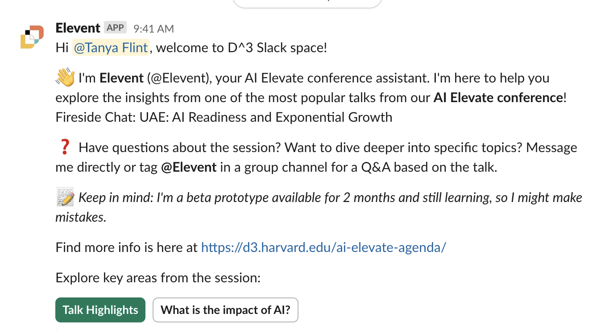

>###### I led the development of Elevent, an AI tool to enhance participant engagement at Harvard conferences.

Elevent is a personalized event companion, built to capture key content, generate tailored summaries, and provide interactive answers through the Slack community channel. Speaker transcripts are transformed into a searchable knowledge base, while pre-event surveys and registration data shape responses to individual goals and interests.

Powered by a LLM, the bot delivers concise, personalized summaries and allows participants to query content directly. From this pilot, Elevent is emerging as an active community tool, extending conference participation even to those who didn’t attend.

Instead of attendees forgetting 90% of what they hear after a keynote or being unable to attend, Elevent enables them to retain and act on the most relevant insights. For companies investing in conferences, this translates into measurable ROI through deeper lead nurturing, better post-event follow-up, and higher conversion rates.

