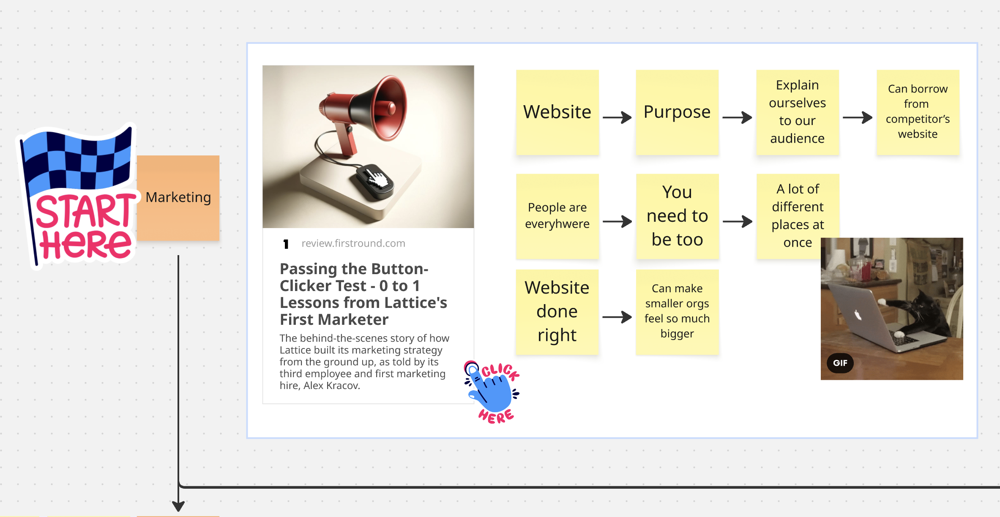
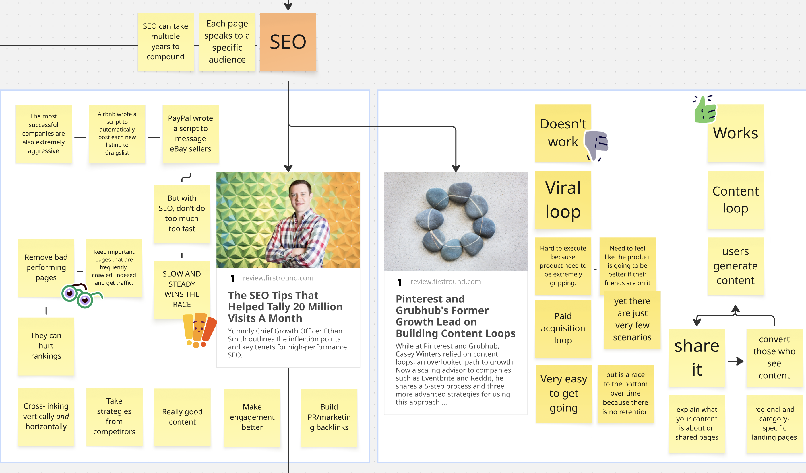
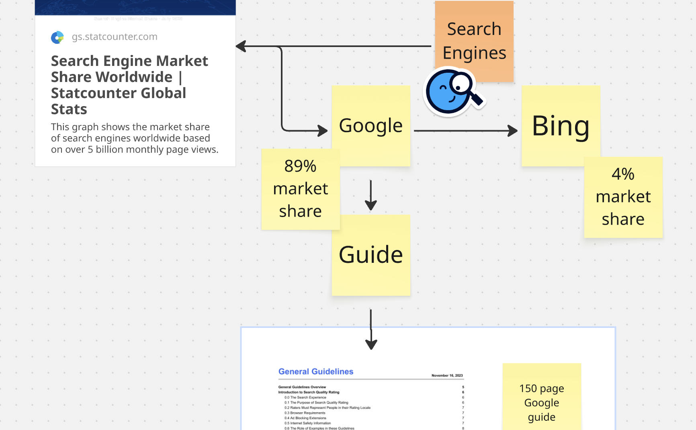
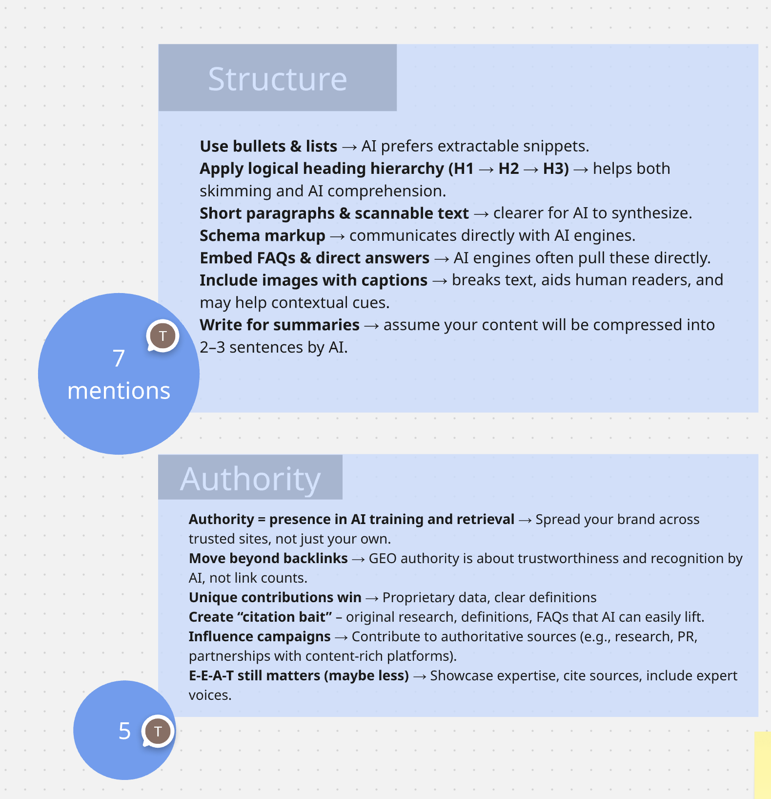
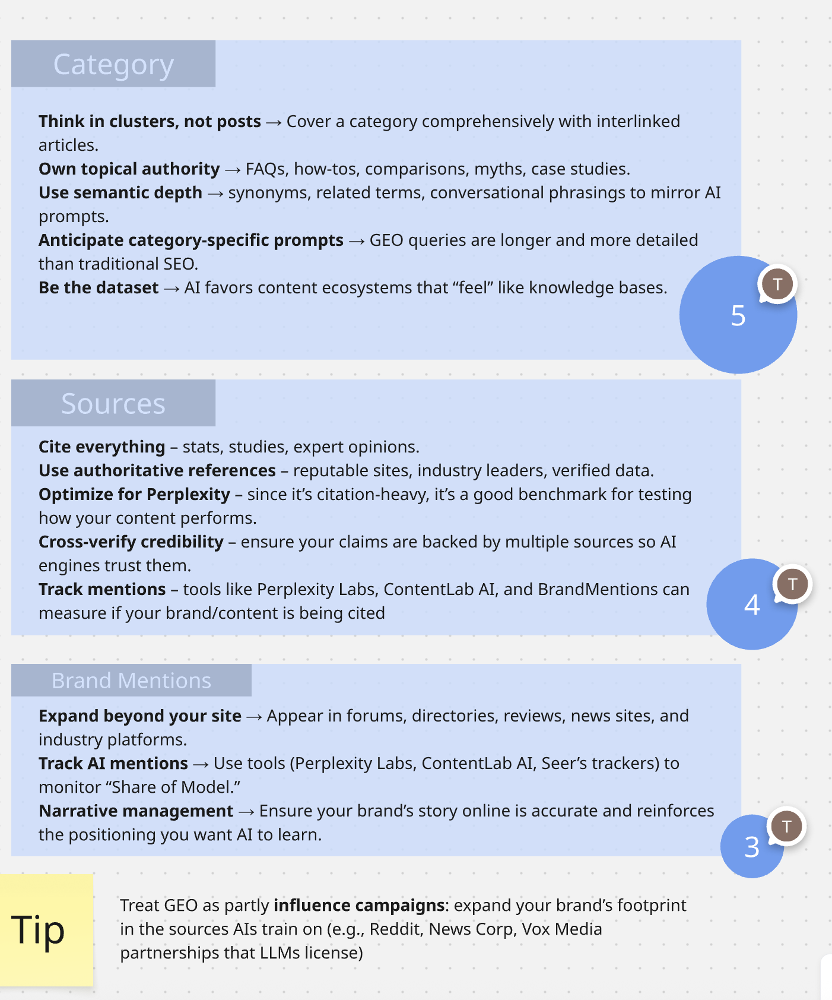

>###### Your website is no longer just for people or search engines. It’s also for generative engines like ChatGPT. SEO still matters, but GEO is emerging fast and Bing is back in play. Consumers are shifting toward AI-driven search, especially in retail. Read on for practical GEO implementations.

Whether you’re just starting a website or already have one, it’s worth asking: what’s the purpose of your site? At its core, it’s an introduction — a first handshake that tells your audience who you are.

Here’s the twist: today, that introduction isn’t only to people or search engines like Google. It’s also to artificial intelligence models such as ChatGPT or Anthropic Claude.

Which means you’re no longer just making a first impression, you’re teaching AI how to understand and present your brand. The First Round Review article on [Passing the Button Clicker Test](https://review.firstround.com/passing-the-button-clicker-test-and-other-0-to-1-lessons-from-lattices-first-marketing-hire/) captures the opportunity well: if you’re small, a website is your chance to feel bigger. The article also highlights the value of “button-clicker skills” the practical, hands-on abilities that turn ideas into action. Designing in Figma, launching an email campaign, or learning how to prompt AI might feel minor on their own. Together, they form the builder's toolkit.

### SEO remains a cornerstone

Even the best builders need people to actually find their site. The most reliable long-term strategy is Search Engine Optimization (SEO). It starts with creating [high-quality content that speaks directly to different audiences](https://review.firstround.com/the-seo-tips-that-helped-tally-20-million-visits-a-month/) through personalized pages.

To scale further, it can lean on user-generated content. When you invite contributions and sharing, you create a natural [content loop](https://review.firstround.com/pinterest-and-grubhubs-former-growth-lead-on-building-content-loops/). Every new post, review, or article brings in fresh readers. Over time, these loops expand your reach and strengthen your site’s search rankings.

### GEO is a twist

Strong rankings aren't just about search engines anymore. It’s about how both search and generative engines perceive your content. For years, one player dominated: Google, which still holds nearly [90% of the search engine market](https://gs.statcounter.com/search-engine-market-share). Winning on Google meant winning at SEO.

But that’s starting to change.

ChatGPT, powered by Bing search and its own crawler, is emerging as a major distribution channel. It accounts for [40% of LLM app downloads](https://www.statista.com/forecasts/1423975/world-generative-ai-text-tool-market-share) and holds [83% of the AI chatbot market share](https://gs.statcounter.com/ai-chatbot-market-share), well ahead of Perplexity, Microsoft Copilot, and others. That means optimizing for Bing search may soon be as important as optimizing for Google.

In fact, appearing highly on both Google and Bing is strongly [correlated to visibility in ChatGPT 4o model](https://www.seerinteractive.com/insights/what-is-generative-engine-optimization-geo).

### Consumer shifts toward GEO

Generative engines are here to stay, and so is the need to optimize your brand for them. Retail shows an example of this shift. An [Adobe Analytics study](https://blog.adobe.com/en/publish/2025/03/17/adobe-analytics-traffic-to-us-retail-websites-from-generative-ai-sources-jumps-1200-percent) analyzing 1 trillion visits found that traffic from generative AI sources to US retail websites jumped 1200%. A companion survey revealed that 39% of consumers now prefer AI search for online shopping, and 92% said it improved their experience.

### Capture the opportunity
Here's a cross-referenced review of several emerging guides on GEO. A few clear patterns stood out.

While brand mentions are often discussed, most articles emphasized something far more straightforward: on-page structural changes that make your content easier for AI to parse. Most sources highlighted this as the best place to start:
- Use bulleted lists (like this one)
- Add clear headings
- Insert FAQs
- Apply proper schema markup
- Write with summaries in mind

The next theme was authority. Building credibility through citations and trusted references came up repeatedly. Another clear shift is moving away from writing one-off topical posts to creating content that represents and owns an entire category.
- Contribute to authoritative sources
- Cite your work
- Get your brand mentioned across trusted sites

See more actionable tips:

### Interact with this article
See the sources, interact with the content and explore more.

<iframe width="768" height="432" src="https://miro.com/app/live-embed/uXjVI47Wmak=/?embedMode=view_only_without_ui&moveToViewport=1489,167,1179,788&embedId=655063259035" frameborder="0" scrolling="no" allow="fullscreen; clipboard-read; clipboard-write" allowfullscreen></iframe>