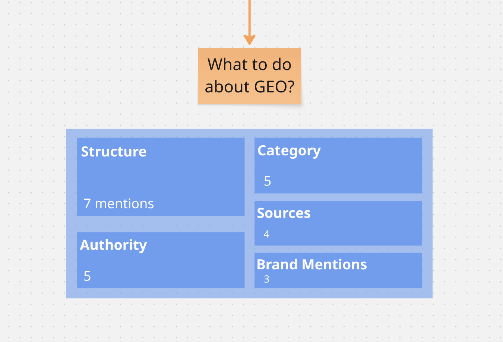

>###### Your website is no longer just for people or search engines. It also serves generative engines like ChatGPT. SEO still matters, but GEO is emerging fast and Bing is back in play. Consumers are shifting toward AI-driven search, especially in retail. Read on for practical GEO implementations.

For brand managers and business owners, it's worth asking yourself: what’s the purpose of your site? At its core, it’s an introduction — a first handshake that tells your audience who you are.

Here’s the twist: today, that introduction isn’t only to people or search engines like Google. It’s also to artificial intelligence models such as OpenAI ChatGPT or Anthropic Claude.

Which means you’re no longer just making a first impression, you’re teaching AI how to understand and present your brand. The First Round Review article on [Passing the Button Clicker Test](https://review.firstround.com/passing-the-button-clicker-test-and-other-0-to-1-lessons-from-lattices-first-marketing-hire/) captures the opportunity well: 
>If you’re small, a website is your chance to feel bigger. 

The article also highlights the value of “button-clicker skills” for marketers, the hands-on abilities that turn ideas into action. Designing in Figma, launching an email campaign, or learning how to prompt AI might feel minor on their own. Together, they form the builder's toolkit.

### SEO remains a cornerstone

Search Engine Optimization (SEO) remains a cornerstone of long-term growth strategy, ensuring that great products and ideas are discoverable. It starts with creating [high-quality content that speaks directly to different audiences](https://review.firstround.com/the-seo-tips-that-helped-tally-20-million-visits-a-month/) through personalized pages.

To scale further, it can lean on user-generated content. When you invite contributions and sharing, you create a natural [content loop](https://review.firstround.com/pinterest-and-grubhubs-former-growth-lead-on-building-content-loops/). Every new post, review, or article brings in fresh readers. Over time, these loops expand your reach and strengthen your site’s search rankings.

### Why Generative Engine Optimization matters

Strong rankings aren't just about search engines anymore. It’s about how both search and generative engines perceive your content. For years, one player dominated: Google, which still holds nearly [90% of the search engine market](https://gs.statcounter.com/search-engine-market-share). Winning on Google meant winning at SEO.

But that’s starting to change.

ChatGPT, powered by Bing search and its own crawler, is emerging as a major distribution channel. ChatGPT accounts for [40% of LLM app downloads](https://www.statista.com/forecasts/1423975/world-generative-ai-text-tool-market-share) and holds [83% of the AI chatbot market share](https://gs.statcounter.com/ai-chatbot-market-share), well ahead of Perplexity, Microsoft Copilot, and others. That means optimizing for Bing search may soon be as important as optimizing for Google.

In fact, appearing highly on both Google and Bing is strongly [correlated to visibility in ChatGPT 4o model](https://www.seerinteractive.com/insights/what-is-generative-engine-optimization-geo).

### Consumer shifts toward GEO

Generative language models are here to stay, and so is the need to optimize your brand. Retail shows an example of this shift. An [Adobe Analytics study](https://blog.adobe.com/en/publish/2025/03/17/adobe-analytics-traffic-to-us-retail-websites-from-generative-ai-sources-jumps-1200-percent) analyzing 1 trillion visits found that traffic from generative AI sources to US retail websites jumped 1200%. A companion survey revealed that 39% of consumers now prefer AI search for online shopping, and 92% said it improved their experience.

### Capture the opportunity
Here's a cross-referenced review of several emerging guides on GEO. A few clear patterns stood out.

While brand mentions are often discussed, most articles emphasized something far more straightforward: on-page structural changes that make your content easier for AI to parse. Most sources highlighted this as the best place to start:

#### Structure
- **Use bullets & lists**(like this one) → AI prefers extractable snippets.
- **Apply logical heading hierarchy (H1 → H2 → H3)** → helps both skimming and AI comprehension.
- **Short paragraphs & scannable text** → clearer for AI to synthesize.
- **Schema markup** → communicates directly with AI engines.
- **Embed FAQs & direct answers** → AI engines often pull these directly.
- **Include images with captions** → breaks text, aids human readers, and may help contextual cues.
- **Write for summaries** → assume your content will be compressed into 2–3 sentences by AI.
- **Provide an `llm.txt` file** → a new convention that signals to AI crawlers how to best use your content.

The next theme was authority. Building credibility through citations and trusted references came up repeatedly. 

#### Authority
- **Authority = presence in AI training and retrieval** → Spread your brand across trusted sites, not just your own.
- **Move beyond backlinks** → GEO authority is about trustworthiness and recognition by AI, not link counts.
- **Unique contributions win** → Proprietary data, clear definitions
- **Create "citation bait"** – original research, definitions, FAQs that AI can easily lift.
- **Influence campaigns** → Contribute to authoritative sources (e.g., research, PR, partnerships with content-rich platforms).
- **E-E-A-T still matters (maybe less)** → Showcase expertise, cite sources, include expert voices.

Another clear shift is moving away from writing one-off topical posts to creating content that represents and owns an entire category.

#### Category
- **Think in clusters, not posts** → Cover a category comprehensively with interlinked articles.
- **Own topical authority** → FAQs, how-tos, comparisons, myths, case studies.
- **Use semantic depth** → synonyms, related terms, conversational phrasings to mirror AI prompts.
- **Anticipate category-specific prompts** → GEO queries are longer and more detailed than traditional SEO.
- **Be the dataset** → AI favors content ecosystems that “feel” like knowledge bases.

#### Sources
- **Cite everything** – stats, studies, expert opinions.
- **Use authoritative references** – reputable sites, industry leaders, verified data.
- **Optimize for Perplexity** – since it’s citation-heavy, it’s a good benchmark for testing how your content performs.
- **Cross-verify credibility** – ensure your claims are backed by multiple sources so AI engines trust them.

#### Brand mentions
- **Expand beyond your site** → Appear in forums, directories, reviews, news sites, and industry platforms.
- **Track AI mentions** → Use Perplexity to monitor mentions.
- **Narrative management** → Ensure your brand’s story online is accurate and reinforces the positioning you want AI to learn.

**Tip:**   Treat GEO as partly influence campaigns: expand your brand’s footprint in the sources AIs train on (e.g., Reddit, News Corp, Vox Media partnerships that LLMs license)

For companies, optimizing for generative engines is no longer optional. GEO extends beyond traditional SEO by ensuring that AI systems accurately represent your brand, products, and expertise. Done well, this translates into greater visibility in AI-driven search, higher-quality inbound traffic, and stronger brand authority across emerging discovery channels. For growth teams, GEO is not just a marketing tactic — it’s a strategic investment in how future customers will first encounter and trust your brand.

### Interact with this article
See the sources, interact with the content and explore more.

<iframe width="768" height="432" src="https://miro.com/app/live-embed/uXjVI47Wmak=/?embedMode=view_only_without_ui&moveToViewport=1489,167,1179,788&embedId=655063259035" frameborder="0" scrolling="no" allow="fullscreen; clipboard-read; clipboard-write" allowfullscreen></iframe>