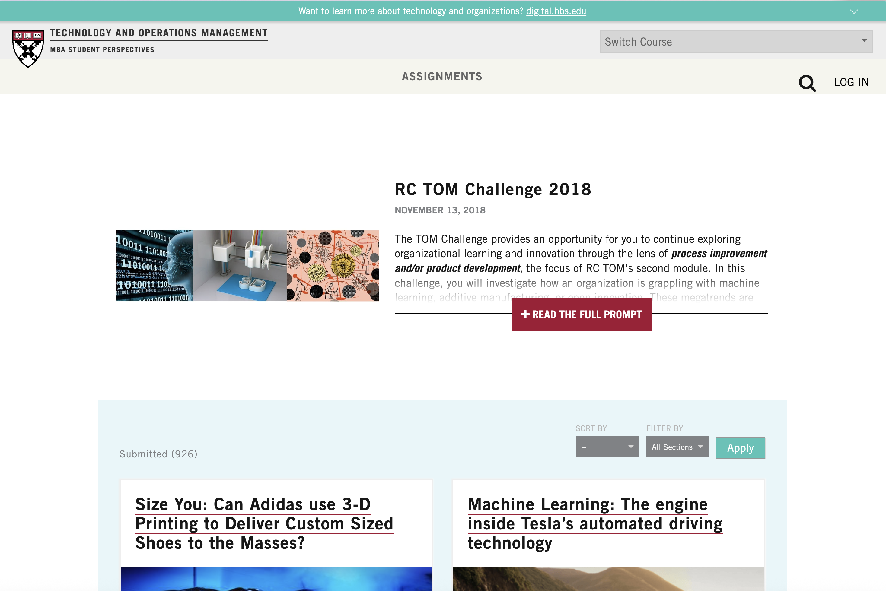

>###### Developed a [classroom assignment platform](https://d3.harvard.edu/platform-rctom/) that published student work online, transforming coursework into a competitive content engine. Scaled across multiple MBA classrooms, driving top-tier SEO performance and motivating students through public accountability.
 
Student work hidden behind learning management systems benefits no one. What if assignments became public by default?

#### My Role
As Product Manager, I led the development and evolution of a platform where MBA student assignments were published online rather than kept in closed systems. The public accountability motivated students to write with greater care, knowing their work would be read beyond the classroom.

#### Impact
- Scaled across multiple MBA courses
- Attracted over 1 million visitors annually
- Generated high-quality, niche content that consistently ranked well in search engines
- Drove significant organic traffic, elevating us among top university sites
- Created a self-sustaining content engine that stood alongside formal university publications
- Prepared students for professional contexts where thoughtful public writing is the norm

#### The Bigger Picture
Classroom assignments became a strategic asset — benefiting students (portfolio building), the institution (SEO/visibility), and the broader community (accessible knowledge). A reminder that the best product decisions create value for multiple stakeholders simultaneously.

**Visit the platform:** [d3.harvard.edu/platform-rctom](https://d3.harvard.edu/platform-rctom/) 