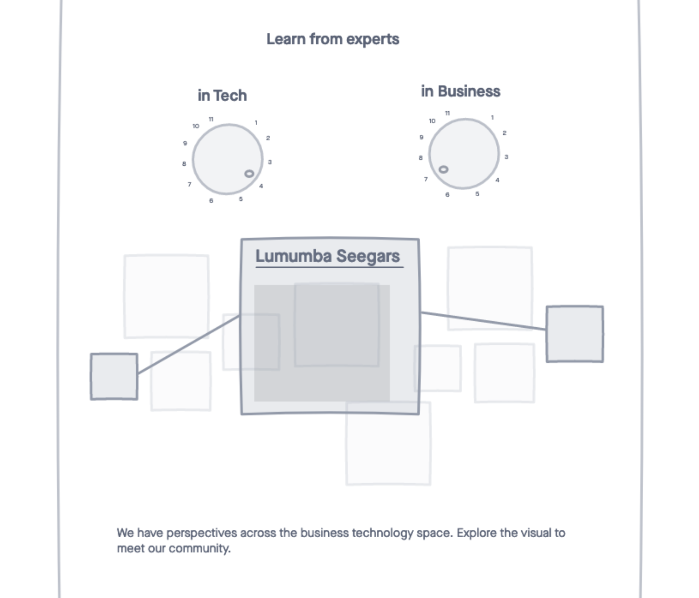
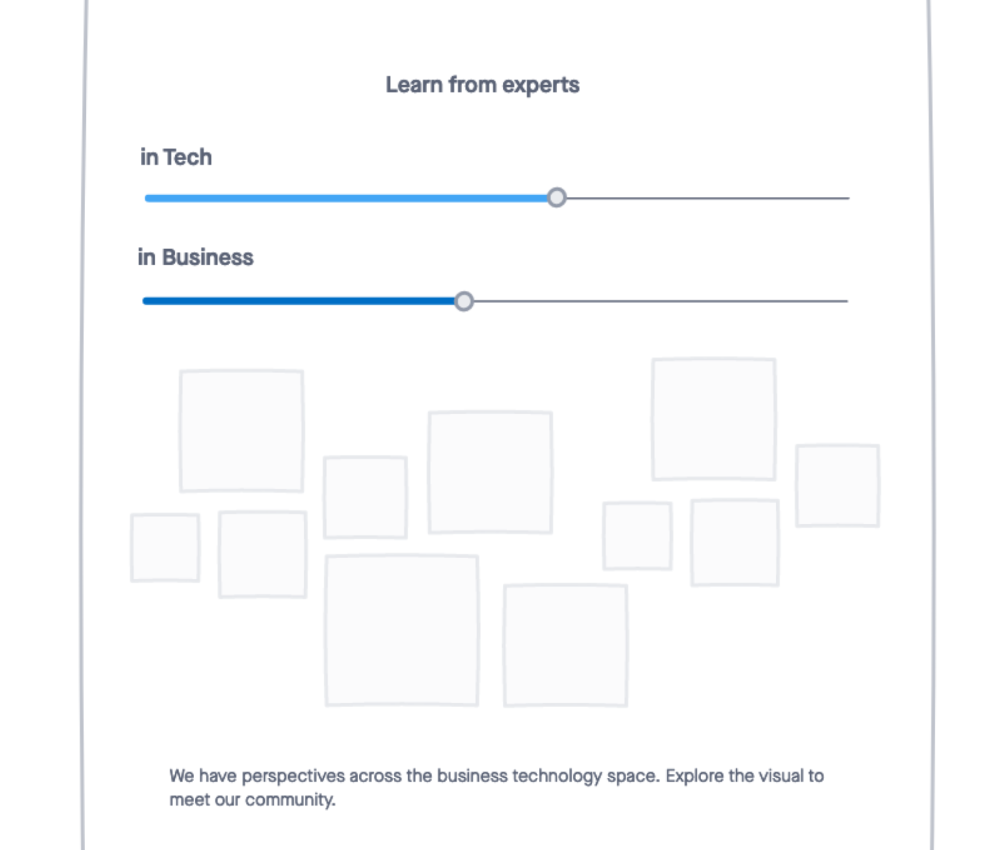
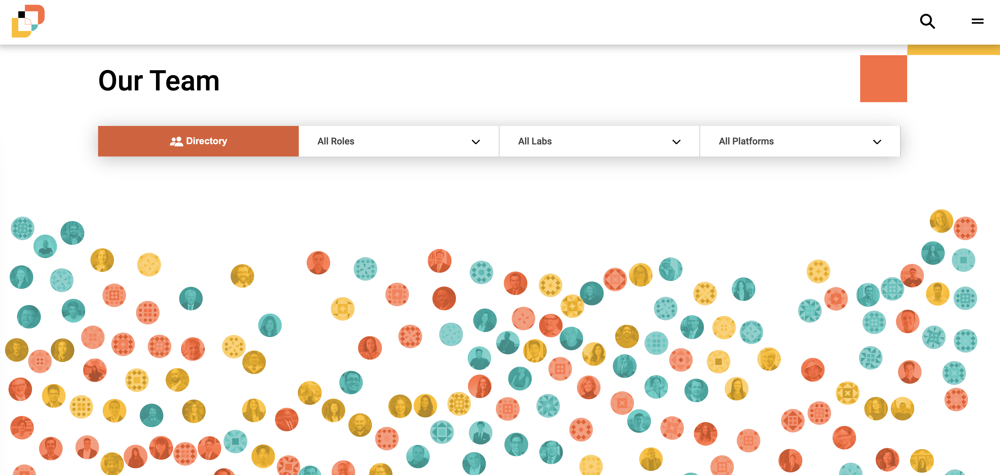

>###### Designed a dynamic community platform. Through equity-driven design, flexible filtering across research labs, and content-rich profiles, we built a scalable platform supporting 200+ people that helped evolve a small team into a research institute.

In 2022, my team faced a question: How do you transform a static people directory page into a living community that reflects values of deep engagement, inclusivity, and transparency?

The existing people page functioned like a phonebook - it told you who was involved, but not why they mattered or how they connected. Our goal was to expand beyond Harvard's walls and welcome diverse voices from the global tech community.

### My Role

As Product Manager, I led the technical strategy and design implementation for this transformation, working closely with design and content teams to turn ambitious concepts into a functional, scalable platform.

### Research-Driven Approach

We started with user journey mapping to understand our primary audience: **makers**, practitioners with their hands on the keyboard who are building the future of technology. 

This was a deliberate strategic shift. Harvard naturally attracts academics and business leaders, but in the rapidly evolving space of emerging technology, we needed to reach the people actually *doing the work*: engineers, designers, product builders, and technologists applying new ideas in their daily practice. These makers were looking for:

1. **New perspectives from experts** who express compelling ideas about digital transformation
2. **People they'd heard about** through news, social media, or colleagues  
3. **Opportunities to participate** and contribute to the community

The critical insight: visitors weren't just looking for names. They were looking for *ideas, perspectives, and connection points*.

### The Solution

We built a multi-dimensional people platform with three core innovations:

**1. Content-Rich Profiles**
We made a deliberate choice to feature more makers on our people page: the researchers, designers, developers, and staff doing hands-on work, not just senior faculty and thought leaders. This shift demonstrated our community's practical involvement in building and experimenting with emerging technology.

Instead of basic biographical information, each profile showcases the person's contribution through their own voice: a perspective on their work, their "why," and links to our work. This transforms profiles from credentials into conversation starters.

**2. Dynamic Filtering System**  
Rather than forcing people into rigid categories (faculty vs. non-faculty, Harvard vs. non-Harvard), we created a flexible taxonomy. This lets visitors slice the community in ways that make sense for their interests, not our org chart.

**3. Relationship Intelligence**  
Profile pages suggest related people based on shared topics, creating natural pathways for discovery. If you land on someone working on equity in tech, you're introduced to others in that space, fostering the "expand your world" principle we envisioned.

### Design for Equity

Throughout the project, we approached people profiles with care and intentionality, recognizing that small UI decisions carry significant meaning. Every design choice reflected our commitment to equity and inclusion.

**The colorful overlay system** was one of our most intentional design choices. Each profile thumbnail displays a tinted brand color overlay that lifts on hover, temporarily obscuring race, age, and rank. This subtle interaction signals a unified community, ensuring ideas and contributions take precedence over credentials or appearance.

These weren't aesthetic choices. They were statements about whose voices matter and how we signal that in product design.

### Technical Implementation

The platform required:
- Custom WordPress content architecture with flexible taxonomies
- Advanced filtering UI that handles 200+ profiles across multiple dimensions
- Search functionality that indexes both biographical and contribution content
- Responsive design that works across the Harvard digital ecosystem
- Careful implementation of the overlay system to maintain accessibility while achieving equity goals

### Impact

The redesign successfully supported the evolution from a Harvard-centric initiative to a global research community. Key outcomes:

- **Increased engagement**: Filtering system enables visitors to find their "people" quickly
- **Improved discoverability**: Content-rich profiles rank better in search and provide value beyond simple contact info
- **Scalable architecture**: System now manages 200+ profiles across faculty, researchers, affiliates, and students
- **DEI advancement**: Flexible categorization and equitable visual treatment make diverse voices more discoverable and valued

### Lessons Learned

**1. Content is the real product**  
The most innovative UX can't compensate for thin content. By investing in "why" and "how" narratives alongside the "who," we created profiles people actually want to read.

**2. Category design matters**  
Traditional academic labels (faculty, student, staff) didn't serve our audience. Reframing the organization around *what people work on* and *how they contribute* made the community more accessible.

**3. Design decisions are value statements**  
Every pixel communicates something. The overlay system, the lack of hierarchy, the equal visual weight — these weren't just design preferences but deliberate choices about equity and inclusion that required deep discussion and intentional implementation.

**4. Build for evolution**  
The flexible taxonomy system has allowed the research institute to add new labs, roles, and platforms without restructuring the core architecture, which was critical for a rapidly growing institute.

### Reflection

This project demonstrated how thoughtful information architecture and intentional design can transform a directory into a discovery platform that embodies organizational values. By centering user needs ("help me learn from experts," "help me find my people") over organizational convenience, and by embedding equity into every design decision, we created something that serves both the institution and its community.