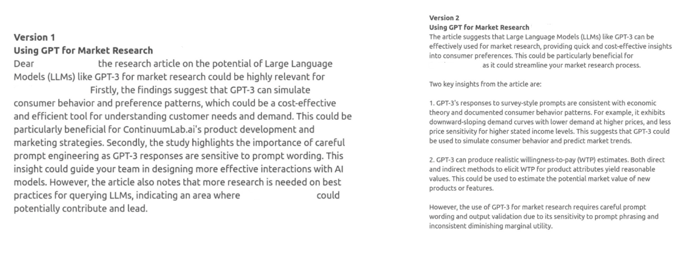

## Introduction

<<<<<<< HEAD
Delivered a proof of concept to high profile executives and successfully developed an evaluation and framwork for delivering bite-sized actionable insights personalized for each individual. 
=======

I was tasked with delivering a demo at a gathering of C-level executives from the tech sector and beyond, the plan included a day filled with programming and introductions. We were enthusiastic about showcasing our forward-thinking vision and expertise in data science.

To prepare for this event, we embarked on a four-week challenge to develop a proof of concept that would not only impress but also provide a valuable and impactful experience. This project aimed to demonstrate our ability to deliver personalized, high-impact content.

>As a data scientist, I attempted to develop a high-quality recommendation algorithm capable of providing impactful summaries of research papers, along with individually personalized opening and closing paragraphs. These elements were to be integrated into a mobile-first web page, ensuring convenient access during the event.

We faced several challenges from the outset, including the "cold start" problem due to the absence of prior user behavior data and the limited scale of available content. This scenario presented a unique opportunity to test a recommendation engine powered solely by Large Language Models (LLMs), given the small context window and the potential of LLMs in few-shot scenarios as a recommender engine ([Dai, et al.](https://arxiv.org/pdf/2305.02182.pdf)). Our main hypothesis was based on the significant public information available about our target user, which could potentially be used in the pre-training models like GPT-4, leading to higher quality recommendations based on the context embedded in the model weights. This approach was also encouraged by the fact that using LLMs for recommendations is an active research area ([Wu, et al.](https://arxiv.org/pdf/2305.19860.pdf)).

The process involved iterative prompt engineering, utilizing the GPT-4 model to generate recommendations based on a provided list of assets. By conducting A/B testing between GPT-3.5, GPT-4 models, and different versions of prompt responses we gauged the efficacy of each prompt through feedback from internal project stakeholders.

 

For this application, the emphasis was on quality over scale. We adopted a hands-on approach to evaluation, allowing us to identify and rectify critical errors more effectively. An inherent challenge with LLM recommender systems is position bias, for any list of items that included in a prompt the model is more likely to recommend items closer to the top of the list. Spotting this critical issue we turned it to our advantage by sorting the list by recent, research-based content that's more important to promote from a communications stand point.

Developing impactful summaries for each research paper was another crucial phase. We established a document ingestion pipeline and experimented with various few-shot learning prompts to optimize for a consistent format that highlighted personalized, actionable, data-driven insights from the research. Through multiple iterations, we sought the ideal format to ensure consistency in the model's output, and adjusting the temperature settings to find the balance between detail and conciseness. A couple of key leranings were that the model generates longer passages of text by default so there were instructions in the prompt to make it shorter and tweaked the temperature parameter. Some of the initial parameters were guided by exsting research ([Gao, et al.](https://arxiv.org/pdf/2303.14524.pdf)). 

Finally, we adjusted the temperature setting in our last prompt to encourage greater variability in responses. The temperature parameter controls the randomness of the predictions by scaling the logits before applying the softmax operation. A higher temperature results in a softer probability distribution over the words, making the model more likely to choose less probable words, thereby increasing diversity and creativity in the output. This adjustment aimed to generate more personalized and creative opening and closing statements for each viewer, based on the summaries and recommendations provided.

This venture was enlightening, enabling us to showcase a persuasive proof of concept to distinguished executives in just four weeks. 

>Although further testing is essential to systematically assess our initial theory—that individuals with extensive public profiles would receive higher-quality recommendations—early results appear promising. 

We observed numerous instances where summaries incorporated information about a person beyond the data supplied in the prompts, alongside unforeseen recommendations that, upon further investigation, were deemed high-quality. Furthermore, this project facilitated the creation of an evaluation framework designed to provide succinct, tailored insights.
>>>>>>> 813a7f5 (post edits)
